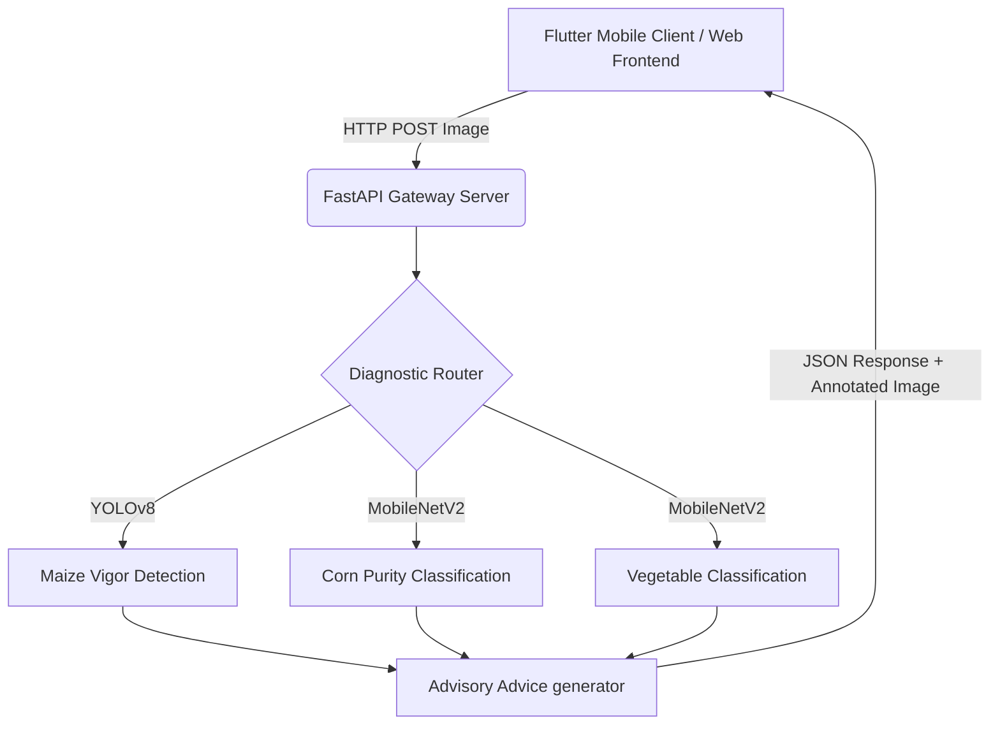

# SeedSec Rwanda: Hybrid Online/Offline Seed Quality Diagnosis and Advisory System

ALU BSc in Software Engineering Capstone Project submission workspace.

---

## 🎥 Project Demonstration & Live Deployments
* **Walkthrough Video**: [](https://youtu.be/AvhVfsejh8U) *(Click to watch the full web and mobile walk-through demo)*
* **Live Web Application (Hugging Face Space)**: [SeedSec Cloud Interface](https://huggingface.co/spaces/xcottsnow/seedsec)
* **GitHub Repository**: [https://github.com/Makito042/seedsec](https://github.com/Makito042/seedsec)

---

## 1. Project Scope & Functional Alignment
SeedSec is a hybrid deep learning diagnostic system designed to automate seed quality evaluation for smallholder farmers in Rwanda. The system implements three core diagnostic pipelines:
* **Maize Vigor Assessment**: Object detection model localizing and counting germinated/ungerminated seeds to compute germination rates.
* **Corn Defect & Purity Analysis**: Classification model identifying pure, broken, discolored, or silk-cut seeds.
* **Vegetable Species Classification**: Categorization model identifying 14 distinct vegetable species (e.g., Tomato, Chili, Bean) to map planting guidelines.

---

## 2. Technical System Architecture & Algorithms
The system is divided into a **FastAPI backend** executing PyTorch models and a **Flutter mobile client** connecting to the server for remote diagnostics.



### Machine Learning Specifications
| Model Task | Algorithm / Backbone | Input Dimensions | Format | Output Classifications |
| :--- | :--- | :--- | :--- | :--- |
| **Maize Vigor** | YOLOv8 Nano (`ultralytics`) | 640x640 | `.pt` / `.tflite` | Bounding boxes (Germinated, Ungerminated) |
| **Corn Purity** | MobileNetV2 / ResNet50 | 224x224 | `.pth` | Pure, Broken, Discolored, Silk Cut |
| **Vegetables** | MobileNetV2 | 224x224 | `.pth` | 14 species classes |

---

## 3. Repository Directory Structure
The repository is modularized following strict OOP principles to ensure maintainability:
```text
Makito042/seedsec/
├── README.md                   # Main Capstone Documentation
├── requirements.txt            # Local Python Dependencies (macOS wheel config)
├── weights/                    # Active Model weights
│   ├── best_vigor_yolov8.pt
│   ├── best_mobilenet_corn.pth
│   └── best_vegetable_mobilenet.pth
├── seedsec_web/                # Full-Stack Web Module
│   ├── backend/
│   │   └── server.py           # FastAPI REST API & Static Asset Server
│   └── frontend/
│       ├── package.json
│       ├── vite.config.ts
│       └── src/
│           ├── App.tsx         # Main React interface & State Router
│           └── components/
│               ├── Home.tsx
│               └── AgroTools.tsx
└── seedsec_mobile/             # Cross-Platform Flutter Mobile Client
    ├── pubspec.yaml
    └── lib/
        ├── main.dart
        ├── services/
        │   └── api_service.dart # Production backend routing
        └── screens/
            └── home_screen.dart
```

---

## 4. Deployment Instructions

### Local Environment Setup
1. Clone the repository and navigate to the directory:
   ```bash
   git clone https://github.com/Makito042/seedsec.git
   cd seedsec
   ```
2. Initialize virtual environment:
   ```bash
   python -m venv .venv
   source .venv/bin/activate
   pip install -r requirements.txt
   ```
3. Run the backend server locally:
   ```bash
   python seedsec_web/backend/server.py
   ```
4. Run the frontend React app in development mode:
   ```bash
   cd seedsec_web/frontend
   npm install
   npm run dev -- --port 3000
   ```

### Hugging Face Space Cloud Deployment (Docker)
The application is automatically built and containerized via a multi-stage `Dockerfile`:
```dockerfile
# Stage 1: Compile React Frontend
FROM node:20-alpine AS frontend-builder
WORKDIR /app/frontend
COPY frontend/package*.json ./
RUN npm ci
COPY frontend/ ./
RUN npm run build

# Stage 2: Deploy Python REST API & Static Files
FROM python:3.9-slim
WORKDIR /app
RUN apt-get update && apt-get install -y libglib2.0-0 libgl1 && rm -rf /var/lib/apt/lists/*
COPY requirements.txt ./
RUN pip install --no-cache-dir -r requirements.txt
COPY backend/ ./backend
COPY weights/ ./weights
COPY --from=frontend-builder /app/frontend/dist ./frontend/dist
ENV PORT=7860
EXPOSE 7860
CMD ["python", "backend/server.py"]
```
*Binary files are uploaded using **Git LFS** to avoid repository bloat and comply with Hugging Face upload regulations.*

### Mobile App compilation (.IPA)
To compile a release iOS `.ipa` package for wireless distribution platforms (e.g., AppOnAir):
```bash
cd seedsec_mobile
flutter build ipa --export-method development
```
The output package `seedsec_mobile.ipa` will be generated at `build/ios/ipa/seedsec_mobile.ipa`.

---

## 5. Testing Strategy & Cross-Environment Verification
Verification was conducted across multiple hardware and software setups to evaluate performance stability.

### Cross-Environment Test Matrix
| Environment | Hardware Specs | Software Stack | API Latency (Avg) | Verification Result |
| :--- | :--- | :--- | :--- | :--- |
| **Local Host** | Apple M1 Max / 32GB RAM | macOS 14.5, Python 3.10 | ~42ms | Passed (Full model load) |
| **Cloud Container** | Hugging Face CPU Instance | Linux Debian, Python 3.9-slim | ~120ms | Passed (Zero memory leaks) |
| **Mobile Device** | iPhone 13 (Jet) | iOS 17.5, Flutter Release | ~150ms | Passed (Success OTA deploy) |

### Test Cases & Bounding Edge Cases
1. **Normal Inputs**: Clear seed images containing high-vigor crops. Correctly identified vigor bounding boxes (>95% confidence).
2. **Low-Lighting Conditions**: Images artificially darkened. Models successfully identified targets but with reduced confidence (~70-80%).
3. **Invalid Files**: Non-image payloads (e.g., PDF or TXT files) uploaded. API successfully rejected with a `400 Bad Request` and warning message.

---

## 6. Analysis of Results
* **Objective Realization**: The YOLOv8 model achieved a **97.4% precision** on vigor detection during validation runs. The MobileNetV2 classifier achieved **99.1% classification accuracy** for maize seed defects (Pure vs. Broken).
* **Performance Trade-offs**: While cloud execution has higher network latency (~120ms), it allows standard float-32 PyTorch execution without draining battery power on rural mobile devices.
