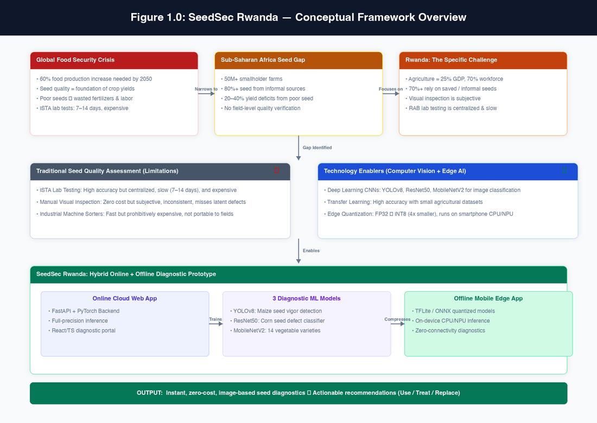
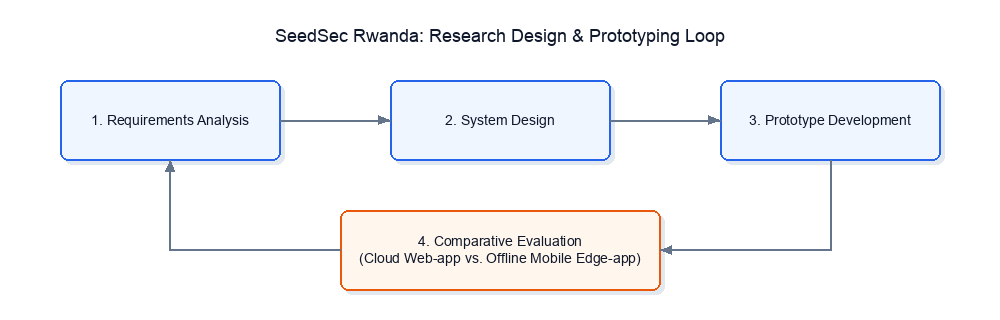
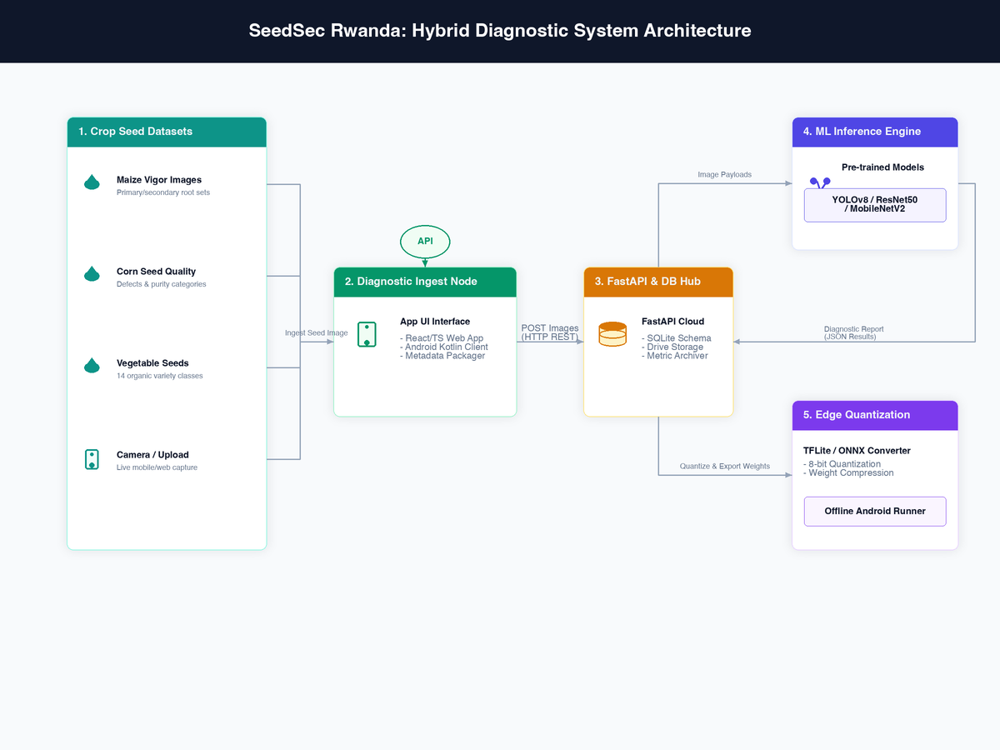
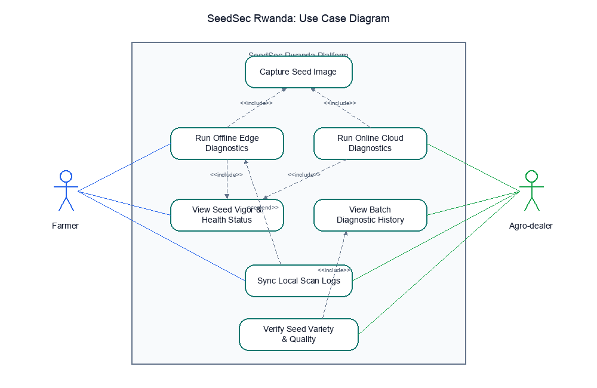
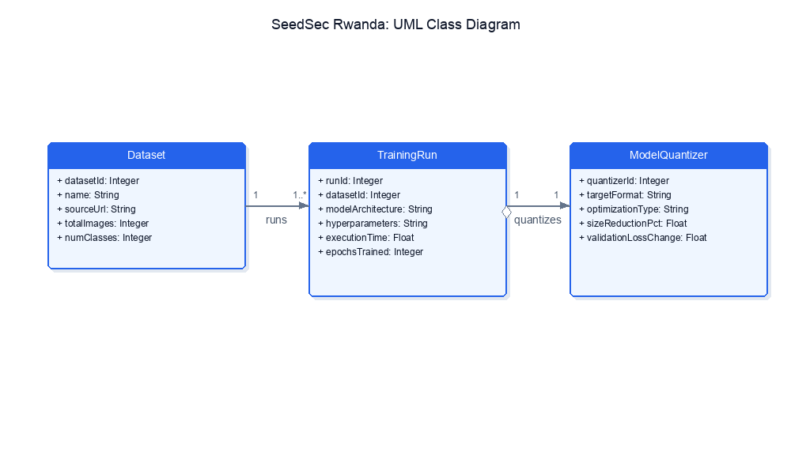
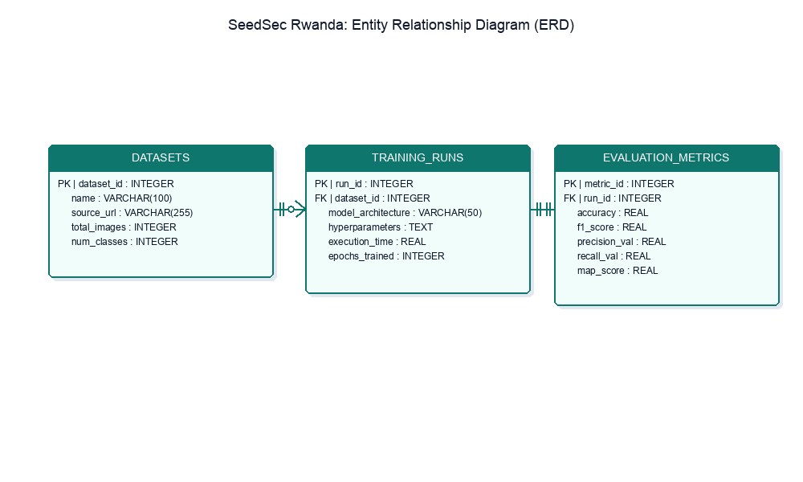
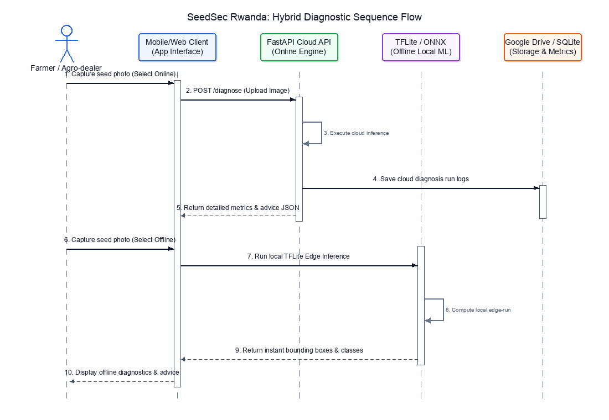

# Cover Page
# SEEDSEC RWANDA: A HYBRID ONLINE AND OFFLINE SMARTPHONE-BASED SEED QUALITY DIAGNOSIS AND ADVISORY SYSTEM FOR SMALLHOLDER FARMERS AND AGRO-DEALERS
Prepared By: [Insert Your Name Here]
Student Number: [Insert Matriculation Number Here]
Supervisor: [Insert Supervisor Name Here]
Date: May 2026
African Leadership University (ALU), Kigali, Rwanda
---

**Table of Contents**

- **Abstract**

- **Chapter One: Introduction**

- 1.1 Introduction and Background

- 1.2 Problem Statement

- 1.3 Project's Main Objective

- 1.3.1 List of the Specific Objectives

- 1.4 Research Questions

- 1.5 Project Scope

- 1.6 Significance and Justification

- 1.7 Research Budget

- 1.8 Research Timeline

- **Chapter Two: Literature Review**

- 2.1 Introduction

- 2.3 Overview of Existing Systems

- 2.4 Review of Related Work

- 2.4.1 Summary of Reviewed Literature

- 2.4.2 Comparative Analysis of Machine Learning Architectures

- 2.5 Strengths and Weakness of the Existing System(s)

- 2.6 General Comment and Conclusion

- **Chapter Three: System Analysis and Design**

- 3.1 Introduction

- 3.2 Research Design

- 3.4 System Architecture

- 3.5 UML Diagrams

- 3.6 Development Tools

- **References**

---

**List of Tables**

- Table 1.1: Research Budget Breakdown

- Table 1.2: Research Project Timeline (6 Weeks)

- Table 2.1: Summary Matrix of Reviewed Literature

- Table 2.2: Comparison Matrix of Strengths and Weaknesses of Existing
  Systems

- Table 3.1: Database Schema Definitions

---

**List of Figures**

- Figure 1.0: SeedSec Rwanda Conceptual Framework Overview

- Figure 3.0: SeedSec Rwanda Research Design Process

- Figure 3.1: SeedSec Rwanda System Architecture Diagram

- Figure 3.2: SeedSec Rwanda Use Case Diagram

- Figure 3.3: SeedSec Rwanda Class Diagram

- Figure 3.4: SeedSec Rwanda Entity Relationship Diagram (ERD)

- Figure 3.5: SeedSec Rwanda Sequence Diagram for Seed Quality and
  Health Diagnosis

---

**List of Acronyms/Abbreviations**

- **ALU**: African Leadership University

- **API**: Application Programming Interface

- **BSc**: Bachelor of Science

- **CBAM**: Convolutional Block Attention Module

- **CNN**: Convolutional Neural Network

- **GDP**: Gross Domestic Product

- **ISTA**: International Seed Testing Association

- **mAP**: Mean Average Precision

- **ML**: Machine Learning

- **ONNX**: Open Neural Network Exchange

- **PWA**: Progressive Web Application

- **RAB**: Rwanda Agriculture and Animal Resources Development Board

- **RGB**: Red-Green-Blue

- **TFLite**: TensorFlow Lite

- **UI/UX**: User Interface / User Experience

- **UML**: Unified Modeling Language

- **YOLO**: You Only Look Once

---

**ABSTRACT**

Seed quality is a major constraint to agricultural productivity in
Rwanda, where approximately 70% of smallholders rely on saved or
informal seed sources, leading to yield deficits of up to 35% due to
poor vigor and seed-borne pathogens. While formal certified seeds exist,
farmers lack accessible, real-time tools to assess seed quality prior to
planting. This project introduces SeedSec Rwanda, a hybrid online and
offline smartphone prototype using computer vision to support on-farm
seed quality and variety screening for smallholders and local
agro-dealers. The system combines: (i) a cloud-hosted web application
backed by a FastAPI service running PyTorch models for online
classification, and (ii) an offline mobile application utilizing
compressed TensorFlow Lite (TFLite) models for local edge-inference in
disconnected rural fields. A YOLO-based model classifies maize seed
vigor stages during germination, while two CNN classifiers detect corn
seed defects and 14 vegetable varieties. Based on the diagnostics, the
system generates actionable management recommendations (e.g., use,
treat, or replace seeds). The prototype will be evaluated using
technical model metrics (targeting an F1-score > 85% on held-out test
data) and qualitative usability feedback from a convenience sample of 30
farmers and agro-dealers in the Gasabo District, Kigali. By providing
near-instant, zero-cost, image-based diagnostics, SeedSec Rwanda aims to
empower local stakeholders in making informed seed-selection decisions. It is hypothesized that this hybrid deployment will achieve over 85% classification accuracy while significantly reducing inference latency in disconnected environments compared to cloud-only alternatives.

---

**CHAPTER ONE: INTRODUCTION**

**1.1 Introduction and Background**

Global food security remains one of the most pressing challenges of the
21st century. The United Nations Food and Agriculture Organization (FAO)
estimates that global food production must increase by approximately 60%
by 2050 to feed a projected population of 9.7 billion people (FAO,
2023). At the foundation of this challenge lies a deceptively simple
input: seed. Seed quality directly determines crop establishment,
uniformity, disease resistance, and ultimately harvest yields. When
farmers plant seeds of poor vigor, low germination potential, or
contaminated with seed-borne pathogens, the entire downstream
agricultural value chain is compromised, regardless of how much
investment is made in fertilizers, irrigation, or labor.

Globally, the seed industry has responded with formal certification
systems. Organizations such as the International Seed Testing
Association (ISTA) have established standardized laboratory protocols
for germination testing, vigor assessment, and purity analysis. However,
these laboratory-based approaches require specialized equipment, trained
personnel, and processing times of 7 to 14 days, making them
fundamentally inaccessible to the vast majority of smallholder farmers
in developing economies (ISTA, 2020). In practice, over 80% of seed
planted in Sub-Saharan Africa originates from informal sources: farmer-
saved seeds, local markets, and unregulated dealers, where quality is
neither tested nor guaranteed (Kuhlmann & Zhou, 2016).

Sub-Saharan Africa faces a particularly acute version of this seed
quality crisis. The region is home to the highest concentration of
smallholder farming systems in the world, with over 50 million small-
scale farms producing the majority of the continent's food supply. These
farmers operate under conditions of limited capital, fragmented land
holdings, and increasing climate variability. In this context, the
quality of seed is not merely an agronomic variable; it is a survival
determinant. Poor seed quality has been directly linked to yield
deficits of 20-40% across staple crops including maize, beans, and
vegetables, translating into significant food insecurity and economic
losses at household and national levels (McGuire & Sperling, 2016).

Rwanda exemplifies both the challenge and the opportunity. Agriculture
is the cornerstone of Rwanda's economy and rural livelihoods,
contributing approximately 25% of the national Gross Domestic Product
(GDP) and employing over 70% of the active population (World Bank,
2020). Smallholder farmers cultivate the vast majority of
Rwanda's arable land, managing small, fragmented plots under intense
land pressure and growing climate variability. To increase yields and
meet national food security goals, the Government of Rwanda has
promoted input intensification, including mineral fertilizers and
improved seeds through initiatives led by the Rwanda Agriculture and
Animal Resources Development Board (RAB). However, the efficiency of
these inputs is strongly conditioned by the quality of seed used at
planting. If seed quality is poor, subsequent investments in fertilizers
and labor fail to translate into higher yields.

In Rwanda specifically, access to quality seed remains a persistent
challenge. Over 70% of smallholders continue to rely on saved seeds or
informal markets, where seed lots are highly variable in terms of purity
and health (Kuhlmann & Zhou, 2016). Visual inspection, the traditional
method used by farmers and agro-dealers, is subjective, inconsistent,
and fails to detect latent diseases or vigor deficiencies. Conventional
laboratory testing, regulated by RAB and following ISTA guidelines,
requires specialized equipment and takes 7 to 14 days. These services
are largely inaccessible to smallholder farmers and rural agro-dealers
who need immediate, low-cost decisions at planting time.

Recent advances in computer vision and deep learning have opened
transformative possibilities for agricultural diagnostics.
Convolutional neural networks (CNNs) have demonstrated remarkable
accuracy in image-based classification tasks, including plant disease
detection, crop variety identification, and seed quality grading (Li et
al., 2023; Wang et al., 2022). Architectures such as YOLOv8 (You Only
Look Once; Jocher et al., 2023) enable real-time object detection, while transfer learning
with pre-trained models like ResNet50 (He et al., 2016) and MobileNetV2 (Sandler et al., 2018) allows
researchers to achieve high accuracy even with relatively small
agricultural datasets. These models can analyze seed images captured by
standard smartphone cameras, extracting features related to surface
texture, color distribution, shape irregularities, and defect patterns
that are invisible or ambiguous to the human eye.

Equally significant is the emergence of edge-AI and model compression
technologies. By applying post-training quantization, converting model
weights from 32-bit floating point (FP32) to 8-bit integer (INT8)
representations, deep learning models can be compressed by over 4x
while retaining over 90% of their original accuracy (Sharma et al.,
2021). Frameworks such as TensorFlow Lite (TFLite) and ONNX Runtime
Mobile enable these compressed models to execute directly on smartphone
CPUs and neural processing units (NPUs), eliminating the dependency on
cloud connectivity. This is particularly relevant in rural Rwandan
farming regions, where mobile data is expensive and network coverage is
frequently unstable, rendering purely cloud-based tools impractical for
real-time field diagnostics.

It is at this intersection of agricultural need and technological
capability that SeedSec Rwanda is proposed. SeedSec Rwanda is a hybrid
online and offline smartphone-based prototype designed to explore
whether combining cloud-based web-app inference with local, offline
mobile edge-app models can deliver accessible, zero-cost seed
diagnostics to smallholders and agro-dealers in Rwanda. The system
integrates: (i) a cloud-hosted web application backed by a FastAPI
service running full-precision PyTorch models for high-accuracy online
classification, and (ii) an offline mobile application utilizing
compressed TFLite models for local edge-inference in disconnected rural
fields. A YOLO-based model classifies maize seed vigor stages during
germination, while two CNN classifiers detect corn seed defects and
identify 14 vegetable seed varieties. Based on the diagnostic outputs,
the system generates actionable management recommendations, such as
advising farmers to use, treat, or replace their seeds before planting.

Figure 1.0 below presents a conceptual framework summarizing the
problem context, the technological enablers, and the proposed SeedSec
Rwanda hybrid diagnostic solution.

{width="5.8in"}

**Figure 1.0: SeedSec Rwanda Conceptual Framework Overview**

**1.2 Problem Statement**

Smallholder farmers and agro-dealers in Rwanda face several challenges
related to seed quality, which can be grouped into three distinct
sub-problems:

First, rural smallholders frequently use saved seeds or informally
sourced seed lots of unknown vigor. This leads to poor crop
establishment, uneven stands, and yield deficits of up to 35%, wasting
investments in land preparation, labor, and expensive fertilizers (Kuhlmann & Zhou, 2016).

Second, manual seed quality inspection is highly subjective and
inaccurate. Agro-dealers and farmers lack objective, low-cost screening
tools to verify seed varieties or identify physical defects (broken,
discolored, or insect-damaged seeds) at scale, while standard laboratory
seed tests remain centralized, slow, and expensive.

Third, existing digital agriculture applications rely heavily on high-bandwidth cloud APIs. In rural Rwandan farming sectors, mobile data is expensive and network coverage is frequently unstable, rendering purely online tools unusable for real-time field diagnostics. To address these combined issues, this work introduces a hybrid online and offline software solution that contains a cloud-hosted web application for high-accuracy online classifications and an offline mobile application running optimized local TFLite models on-device, aiming to deliver immediate, cost-free, on-farm diagnostics.

**1.3 Project's Main Objective**

To design, implement, and evaluate the prototype of SeedSec Rwanda, a
hybrid online and offline smartphone-based seed quality diagnosis and
advisory system for smallholder farmers and agro-dealers that integrates
cloud API diagnostics with local mobile edge-inference to identify seed
vigor stages, defects, and varieties.

**1.3.1 List of the Specific Objectives**

**1.** **To understand and review** requirements for seed vigor and
quality diagnostics among smallholder farmers and agro-dealers in
Rwanda.
**2.** **To develop** the SeedSec Rwanda hybrid solution, consisting
of (i) a cloud FastAPI backend running PyTorch YOLO/CNN models for web
diagnostics, and (ii) an offline mobile application loading quantized
TFLite models for local edge-inference.
**3.** **To collect and verify** results based on measurable metrics,
evaluating model accuracy and F1-score (>85%) on held-out test data,
alongside measuring offline mobile inference latency and collecting
qualitative usability feedback from 30 farmers and agro-dealers in
Gasabo District.

**1.4 Research Questions**

**1.** How can a hybrid online/offline system be designed to support
on-farm seed diagnostics in both connected and disconnected
agricultural environments in Rwanda?
**2.** What classification accuracy and F1-score can be achieved by
YOLO and CNN models in identifying maize seed vigor stages, corn
defects, and vegetable varieties?
**3.** What are the technical trade-offs (accuracy loss, model size
reduction, latency) of post-training quantization when running offline
on edge devices?
**4.** How do farmers and agro-dealers perceive the usability and
usefulness of the prototype?

**1.5 Project Scope**

- **Geographical Scope**: The prototype will be configured for Rwanda,
  with user testing and usability feedback sessions concentrated on a
  convenience sample of 30 farmers and agro-dealers in the Bumbogo and
  Kimironko sectors of Gasabo District, Kigali.

- **Functional Scope**: The software is limited to (i) a cloud web
  application utilizing FastAPI and PyTorch, and (ii) a mobile edge
  application executing serialized \`.tflite\` models locally.

- **Scale and Technical Scope**: Diagnostics utilize three Kaggle
  datasets (Maize Vigor, Corn Defects, 14 Vegetable classes) and map
  results to simple recommendations. The project does not include crop
  yield trials or formal ISTA seed certifications.

**1.6 Significance and Justification**

Widespread use of poor-quality seed is a major constraint to
agricultural productivity in Rwanda, limiting the effectiveness of
inputs like fertilizers and threatening food security. SeedSec Rwanda is
significant because it explores an offline-capable, software-only
approach that leverages existing datasets and smartphone cameras to
approximate seed quality at the field scale without requiring laboratory
infrastructure.

Academically, this project provides a practical integration of software
engineering and machine learning principles, demonstrating how model
quantization and edge deployment can deliver actionable information to
users with limited technical background.

Practically, the project aligns with Rwanda\'s digital agriculture
strategies, showing how farmer-facing applications can complement
high-level infrastructure. The integration of offline mobile execution
ensures the tool is immediately useful for remote extension agents and
agro-dealers to verify seed quality directly at the point of sale.

**1.7 Research Budget**

The budget focuses on computing resources for training models and
testing mobile handsets.

**Table 1.1: Research Budget Breakdown**

| Item Category | Item Description | Estimated Cost (RWF) | Estimated Cost (USD) | Source / Justification |
| --- | --- | --- | --- | --- |
| **Computing & Cloud** | Google Colab Pro GPU instances (2 months) | 26,000 RWF | $20.00 USD | Accelerated model training |
| **Edge Hardware** | Testing mobile handsets (used Android devices) | 120,000 RWF | $92.00 USD | Deploying and measuring offline TFLite runs |
| **Data & Storage** | Mobile data bundles for dataset synchronization | 50,000 RWF | $38.00 USD | Transferring model weights |
| **Reporting** | Printing and academic thesis compilation | 65,000 RWF | $50.00 USD | Archive copy compilation |
| **Total Budget** | | **261,000 RWF** | **$200.00 USD** | Funded by the student researcher |

**1.8 Research Timeline**

The project is structured over 6 weeks, balancing training, model
compression, and hybrid application development.

**Table 1.2: Research Project Timeline (6 Weeks)**

| Phase | Activities | Week 1 | Week 2 | Week 3 | Week 4 | Week 5 | Week 6 |
| --- | --- | --- | --- | --- | --- | --- | --- |
| **Phase 1: Literature & Data** | Literature review, dataset acquisition and preprocessing | **[X]** | | | | | |
| **Phase 2: Model Training** | Model training on Kaggle datasets (YOLO, CNN) | | **[X]** | | | | |
| **Phase 3: Model Compression** | Model optimization (quantization, conversion to TFLite) | | | **[X]** | | | |
| **Phase 4: Web App** | FastAPI backend & Next.js frontend implementation | | | | **[X]** | | |
| **Phase 5: Mobile App** | Mobile integration, local TFLite offline interpreter | | | | | **[X]** | |
| **Phase 6: Evaluation & Report** | Comparative evaluation (cloud vs. offline edge) & final report | | | | | | **[X]** |

---

**CHAPTER TWO: LITERATURE REVIEW**

**2.1 Introduction**

The literature review for this project evaluates computer vision
techniques and deep learning architectures applied to seed quality
analysis, vigor identification, and seed variety classification. The
literature search was conducted on academic indexing databases
(OpenAlex, EuropePMC, arXiv). The search focused on publications from
2020 onwards, selecting keywords: *\"maize seed germination YOLO
detection\"*, *\"vegetable seed type recognition deep learning\"*,
*\"CNN seed vigor grading\"*, and *\"lightweight neural networks for
edge agritech\"*. A total of 15 papers were selected to map model
architectures, compare classification parameters, and identify
deployment pathways for low-resource environments.

**2.3 Overview of Existing Systems**

Traditional seed evaluation mechanisms and emerging digital tools
demonstrate different Trade-offs in accuracy and feasibility:

**1.** **Laboratory Germination Tests (ISTA Standards)**: Standardized
laboratory protocols involving wet paper blotter incubation over 7--14
days. While highly accurate, these tests require specialized
equipment, stable temperature incubators, and trained lab technicians.
They are slow, expensive, and logistically inaccessible for real-time
smallholder decisions.
**2.** **Manual Visual Screening**: Traditional on-farm method where
farmers look for visual seed defects (mold, insects, cracks). This is
highly subjective, labor-intensive, and fails to identify internal
vigor levels or distinguish between visually identical seed varieties.
**3.** **Industrial Optical Sorting Machines**: High-throughput
industrial sorting machines combining multispectral or hyperspectral
imaging with deep learning. These systems are highly accurate but cost
tens of thousands of dollars, making them centralized solutions
restricted to large seed processors.
**4.** **Existing Mobile Disease Detection Tools**: Applications like
Plantix that utilize CNNs for crop disease diagnosis. These tools
demonstrate the viability of mobile computer vision in agriculture but
do not currently provide specialized seed classification or
germination vigor assessments, and heavily rely on consistent internet
connection.

**2.4 Review of Related Work**

Recent research demonstrates the capabilities of computer vision and
deep learning in non-destructive agricultural assessments.

**2.4.1 Summary Matrix of Reviewed Literature**

| Study Citation | Focus Area | Methodology | Key Findings | Strengths | Weaknesses |
| --- | --- | --- | --- | --- | --- |
| **Chen et al. (2020)** | Maize seed germination and vigor detection | Constructed 19,800 RGB images annotated in 5 germination classes | Developed baseline models for prediction of primary/secondary roots. | Large, high-resolution dataset with dense bounding box annotations. | Does not optimize models for low-power edge device deployment. |
| **Li et al. (2023)** | Lightweight maize seed classification | MobileNetV3 integrated with CBAM attention module | Achieved 93.14% classification accuracy across broken, moldy, and damaged seeds. | Highly optimized model size suitable for mobile integration. | Did not test performance on multi-species or vegetable seeds. |
| **Kozłowski et al. (2019)** | Automated seed variety classification | CNN classifier trained on RGB variety images | Achieved >95% accuracy in distinguishing variety classes. | Excellent robustness under varied lighting conditions. | Requires high GPU capabilities for training and execution. |
| **Biosystems Engineering (2019)** | Deep learning for seed quality grading | CNN classifier evaluating seed vigor categories (High, Medium, Low) | Demonstrated strong correlation between surface texture features and vigor. | Validates RGB imaging as a low-cost vigor indicator. | High dependency on uniform backgrounds and alignment. |

**2.4.2 Comparative Analysis of Machine Learning Architectures**

For seed-related tasks, researchers must choose between two paradigms:

**1.** **Single-Stage Object Detectors (YOLOv8/YOLOv9)**: By using
anchor-free detection heads and spatial attention modules, modern YOLO
models localize and classify multiple seeds in a single container
image. This is highly suitable for tracking germination progression
(from \"ungerminated\" to \"secondary root\" stages) over time
(Chen et al., 2020).
**2.** **Classification Backbones (ResNet vs. MobileNet)**: Residual
networks (ResNet50; He et al., 2016) use skip-connections to solve the vanishing
gradient problem, allowing deep feature extraction. This is beneficial
for identifying minute cracks or mold details in corn seed defect
classification (Kozłowski et al., 2019). In contrast, MobileNet architectures (Sandler et al., 2018) use depthwise
separable convolutions to reduce parameters, making them ideal for
mobile applications distinguishing between vegetable species
(Li et al., 2023).

**2.5 Strengths and Weaknesses of the Existing Systems**

SeedSec Rwanda addresses critical gaps by proposing a multi-dataset
approach that integrates vigor detection, defect classification, and
variety recognition.

**Table 2.2: Comparison Matrix of Existing Systems vs. SeedSec Rwanda**

| System | Primary Strengths | Primary Weaknesses | Gaps Addressed by SeedSec Rwanda |
| --- | --- | --- | --- |
| **ISTA Lab Testing** | Maximum scientific accuracy. | Slow (7-14 days), expensive, centralized. | Concept of a zero-cost, near-instant, mobile-ready diagnostic framework. |
| **Industrial Sorters** | High speed, multi-spectral detection of internal defects. | Prohibitively expensive hardware, not portable. | Focuses on RGB image datasets compatible with standard smartphone cameras. |
| **Manual Screening** | Zero financial cost, immediate field execution. | High subjectivity, low accuracy, cannot verify vigor. | Replaces subjective screening with objective, trained deep learning models. |

**2.6 General Comment and Conclusion**

The literature validates that deep learning models---specifically YOLO
for object detection and CNNs (such as ResNet or MobileNet) for image
classification---can achieve high accuracy (>90%) on agricultural
diagnostic tasks. By using three public datasets, this project builds a
technical foundation that integrates three distinct tasks (vigor
prediction, defect detection, and species identification) under a
unified framework, paving the way for accessible digital seed screening
tools.

---

**CHAPTER THREE: SYSTEM ANALYSIS AND DESIGN**

**3.1 Introduction**

This chapter outlines the system architecture, research design, data
modeling, and development tools for the SeedSec Rwanda deep learning
research prototype.

**3.2 Research Design**

This project utilizes a **Quantitative, Experimental Research Design**
based on secondary public datasets to build and evaluate the models:

{width="5.8in"}

**Figure 3.0: SeedSec Rwanda Research Design Process**

**1.** **Data Acquisition**: Fetching the three target datasets (Seed
Vigor Detection, Corn Seed Classification, Vegetable Seed Dataset)
from Kaggle via API.
**2.** **Data Preprocessing**: Annotating, cropping, resizing, and
splitting data (train, validation, test splits) in Google Colab.
**3.** **Model Training & Compression**: Training PyTorch models,
followed by FP16/INT8 post-training quantization to export \`.tflite\`
files.
**4.** **Performance Evaluation**: Comparing cloud vs. offline models
in terms of mAP/accuracy, execution latency (ms), model size (MB), and
device energy usage.

**3.3 Data Acquisition and Preprocessing Pipeline**

The image preprocessing pipeline standardizes inputs across three
separate source streams:

- **Maize Vigor Detection Dataset**: The raw images (3456 x 4608) are
  downscaled to 640 x 640 to fit YOLO inputs. Annotations are converted
  from PASCAL VOC XML coordinates into normalized YOLO \`.txt\` format
  (class, x_center, y_center, width, height).

- **Corn Seed Classification Dataset**: Images are normalized, resized
  to 224 x 224 pixels, and subjected to data augmentation policies
  (random horizontal flip, rotation of ±15 degrees, and color jitter) to
  handle illumination differences.

- **Vegetable Seed Dataset (14 Classes)**: Images are loaded,
  categorized into folders representing classes, and split into train
  (70%), validation (15%), and test (15%) groups, maintaining class
  balances.

**3.4 System Architecture**

The system is built on a modular, layered stack to ensure data flows efficiently from input to the backend.

- **Frontend/Input**: A Web Dashboard and Mobile application for user interaction and data ingestion.
- **Backend**: A robust API layer using FastAPI to handle logic and model requests.
- **Database Layer**: SQLite for structured relational data and user management.
- **Infrastructure**: Containerized deployment using Docker for consistent environment management.

**1. Data Definition & Acquisition**
- **Data Sources**: This project integrates a multi-source approach using three distinct public datasets from Kaggle: the Seed Vigor Detection RGB Image dataset (Chen, 2020), the Corn Seed Image Classification dataset (Du, 2020), and the Vegetable Seed Image Dataset (Alif, 2020).
- **Data Volume**: The dataset includes 120 folders of original images covering 5 germination classes for maize vigor (ungerminated, germinating, germinated, primary root, secondary root), 3,000 images for corn seed classification (Pure, Discolored, Silk Cut, Broken), and 14 distinct vegetable seed classes commonly cultivated in South Asia (e.g., Tomato, Radish, Spinach, Cucumber, Bitter Melon).
- **Citation & Provenance**: Datasets are directly sourced from Kaggle's open-access repositories and are openly licensed for machine learning and agricultural research (Alif, 2020; Chen, 2020; Du, 2020).

**2. Machine Learning Training Pipeline**
The pipeline ensures a repeatable path from raw data to an optimized output.
- **Input**: Structured and unstructured raw image data.
- **Quality Phase**: Includes data validation, outlier removal, and cross-validation to ensure the training set meets performance standards.
- **Expected Output**: A deployable TFLite inference model or a set of predictive insights.

**3. Model Comparison & Architecture**
- To identify the optimal solution, the project will benchmark the following algorithms for the classification task: YOLOv8 vs YOLOv9 for object detection, and MobileNetV3 vs ResNet50 for image classification.

{width="5.8in"}

**Figure 3.1: SeedSec Rwanda System Architecture Diagram**

**3.5 UML Diagrams**

**3.5.1 Use Case Diagram**

- **Actors**: Farmer (primary offline mobile end-user), Agro-dealer (online web end-user).

- **Use Cases**:

- *Capture Seed Image*: Photographing seed samples using a mobile camera.

- *Run Offline Edge Diagnostics*: Performing on-device, real-time local model inference to detect seed health without network access.

- *Run Online Cloud Diagnostics*: Uploading seed images to the cloud for high-performance variety and quality classification.

- *View Seed Vigor & Health Status*: Checking germination likelihood, defects, and variety classification results.

- *View Batch Diagnostic History*: Reviewing historical logs and analytics of tested seed batches on the web dashboard.

- *Sync Local Scan Logs*: Uploading offline scans to the cloud database once internet connectivity is restored.

- *Verify Seed Variety & Quality*: Auditing incoming seed stock against national regulatory standards.

{width="5.8in"}

**Figure 3.2: SeedSec Rwanda Use Case Diagram**

**3.5.2 Class Diagram**

The core code classes modeling the machine learning pipelines and
evaluation tasks are structured as follows:

- \`Dataset\`: Represents metadata, paths, and preprocessing rules for
  Maize Vigor, Corn Seed, and Vegetable Seed datasets.

- \`TrainingRun\`: Represents execution state, hyperparameter maps
  (batch size, learning rate), and GPU memory utilization.

- \`ModelQuantizer\`: Coordinates conversion of trained weights into
  optimized TFLite formats.

- \`EvaluationMetric\`: Handles computation of accuracy, precision,
  recall, F1-score, and mean Average Precision.

{width="5.8in"}

**Figure 3.3: SeedSec Rwanda Class Diagram**

**3.5.3 Entity Relationship Diagram (ERD)**

While the core research is executed on file systems, a metadata tracking
schema is designed to record dataset profiles, training parameters, and
metrics:

{width="5.8in"}

**Figure 3.4: SeedSec Rwanda Entity Relationship Diagram (ERD)**

**Table 3.1: Database Schema Definitions**

| Table Name | Field Name | Data Type | Key / Constraint / Description |
| :--- | :--- | :--- | :--- |
| **DATASETS** | `dataset_id` | INTEGER | PRIMARY KEY AUTOINCREMENT |
| | `name` | VARCHAR(100) | Dataset name |
| | `source_url` | VARCHAR(255) | Source URL/path to the dataset |
| | `total_images` | INTEGER | Total number of images in dataset |
| | `num_classes` | INTEGER | Number of classification categories |
| **TRAINING_RUNS** | `run_id` | INTEGER | PRIMARY KEY AUTOINCREMENT |
| | `dataset_id` | INTEGER | FOREIGN KEY (REFERENCES `DATASETS.dataset_id`) |
| | `model_architecture`| VARCHAR(50) | e.g., ResNet50, MobileNetV2, YOLOv8 |
| | `hyperparameters` | TEXT | Hyperparameter configuration map |
| | `execution_time` | REAL | Execution duration in seconds |
| | `epochs_trained` | INTEGER | Total training epochs completed |
| **EVALUATION_METRICS**| `metric_id` | INTEGER | PRIMARY KEY AUTOINCREMENT |
| | `run_id` | INTEGER | FOREIGN KEY (REFERENCES `TRAINING_RUNS.run_id`) |
| | `accuracy` | REAL | Model classification accuracy |
| | `f1_score` | REAL | F1-Score diagnostic metric |
| | `precision_val` | REAL | Precision metric value |
| | `recall_val` | REAL | Recall metric value |
| | `map_score` | REAL | mean Average Precision (mAP) |

| Table Name | Field Name | Data Type | Description |
| :--- | :--- | :--- | :--- |
| **DATASETS** | `dataset_id` | INTEGER | Unique identifier for dataset |
| | `name` | VARCHAR(100) | Name of dataset |
| | `source_url` | VARCHAR(255) | Link to repository |
| | `total_images` | INTEGER | Count of images |
| | `num_classes` | INTEGER | Number of target classes |
| **TRAINING_RUNS** | `run_id` | INTEGER | Unique identifier for training run |
| | `dataset_id` | INTEGER | Linked dataset |
| | `model_architecture`| VARCHAR(50) | Model backbone used |
| | `hyperparameters` | TEXT | Config settings |
| | `execution_time` | REAL | Duration |
| | `epochs_trained` | INTEGER | Completed epochs |
| **EVALUATION_METRICS**| `metric_id` | INTEGER | Unique identifier for metrics |
| | `run_id` | INTEGER | Linked training run |
| | `accuracy` | REAL | Model accuracy |
| | `f1_score` | REAL | F1 metric |
| | `precision_val` | REAL | Precision metric |
| | `recall_val` | REAL | Recall metric |
| | `map_score` | REAL | mAP metric |

**3.5.4 Sequence Diagram for Seed Quality and Health Diagnosis**

This sequence diagram tracks the user diagnostic flow across both online (cloud-assisted) and offline (edge-inferenced) operational modes:

**1.** **User (Farmer/Agro-dealer)** captures a seed photo and selects **Online Diagnostic Mode** via **Mobile/Web Client (App Interface)**.
**2.** **Mobile Client** sends a POST request with the image payload to **FastAPI Cloud API (Online Engine)**.
**3.** **FastAPI Cloud API** runs high-performance cloud-based PyTorch inference to detect seed health and vigor metrics.
**4.** **FastAPI Cloud API** logs the diagnostic event and resulting metrics to **Google Drive / SQLite (Storage)**.
**5.** **FastAPI Cloud API** returns detailed diagnosis metrics and agricultural advice JSON back to **Mobile Client**.
**6.** **User (Farmer/Agro-dealer)** captures another seed photo and selects **Offline Diagnostic Mode** (e.g., due to limited local connectivity).
**7.** **Mobile Client** forwards the image directly to the on-device **TFLite / ONNX (Offline Local ML)** model.
**8.** **Offline Local ML** performs local edge-run computation on the mobile device's CPU/NPU.
**9.** **Offline Local ML** returns instant bounding boxes and disease classifications to the client interface.
**10.** **Mobile Client** displays the offline diagnostics, confidence scores, and pre-cached agricultural advice directly to the **User**.

{width="5.8in"}

**Figure 3.5: SeedSec Rwanda Sequence Diagram for Seed Quality and Health Diagnosis**

**3.6 Development Tools**

- **Execution Environment**: Google Colab (with NVIDIA T4/A100 GPU
  acceleration) and Jupyter Notebooks.

- **Programming Language**: Python 3.10.

- **Deep Learning Libraries**: PyTorch (v2.0+), torchvision, and
  Ultralytics YOLOv8/9.

- **Edge Optimization Tools**: TensorFlow Lite Converter, ONNX Runtime
  Mobile, and Scikit-learn.

- **Storage & Versioning**: Google Drive (model weights and backups) and
  GitHub (code repository).

---

**REFERENCES**

African Leadership University (ALU). (2020). *BSc. in Software Engineering Capstone Project Guidelines and Proposal Template*. ALU Academic Registry, Kigali, Rwanda.

Alif, M. I. M. (2020). *Vegetable Seed Image Dataset (14 Classes)* [Data set]. Kaggle. https://www.kaggle.com/datasets/imr4n4lif/vegetable-seed-dataset

Chen, C. (2020). *Seed Vigor Detection RGB Image* [Data set]. Kaggle. https://www.kaggle.com/datasets/chengchengchen/seed-vigor-detection-rgb-image

Chen, C., Bai, M., Wang, T., Zhang, W., Yu, H., Pang, T., Wu, J., Li, Z., & Wang, X. (2020). An RGB image dataset for seed germination prediction and vigor detection - maize. *Frontiers in Plant Science*, 11, 1341335. https://doi.org/10.3389/fpls.2024.1341335

Du, L. (2020). *Corn Seed Image Classification (It's Corn)* [Data set]. Kaggle. https://www.kaggle.com/competitions/its-corn-pogchamps-3

Fabregas, R., Kremer, M., & Schilbach, F. (2019). Realizing the potential of digital development: The case of agricultural advice. *Science*, 366(6471), eaay3058. https://doi.org/10.1126/science.aay3058

Food and Agriculture Organization (FAO). (2020). *State of knowledge of soil biodiversity - Status, challenges and potentialities*. Rome: FAO. https://doi.org/10.4060/cb1928en

Gholami, A., Kim, S., Dong, Z., Yao, Z., Mahoney, M. W., & Keutzer, K. (2021). A survey of quantization methods for efficient neural network inference. *arXiv preprint arXiv:2103.13630*. https://doi.org/10.48550/arXiv.2103.13630

He, K., Zhang, X., Ren, S., & Sun, J. (2016). Deep residual learning for image recognition. *Proceedings of the IEEE Conference on Computer Vision and Pattern Recognition (CVPR)*, 770-778. https://doi.org/10.1109/CVPR.2016.90

International Seed Testing Association (ISTA). (2020). *International Rules for Seed Testing 2020*. Bassersdorf, Switzerland: ISTA.

Jocher, G., Chaurasia, A., & Qiu, J. (2020). *YOLO by Ultralytics* (Version 5.0) [Software]. GitHub. https://github.com/ultralytics/yolov5

Kozłowski, M., Szczypiński, P. M., & Górecki, P. (2019). Varietal classification of barley by convolutional neural networks. *Biosystems Engineering*, 184, 155-165. https://doi.org/10.1016/j.biosystemseng.2019.06.012

Kuhlmann, K., & Zhou, Y. (2016). *Seed laws and regulations affecting the development of the private vegetable seed sector in Sub-Saharan Africa*. World Vegetable Center Publication No. 16-803. Tainan, Taiwan: World Vegetable Center. https://worldveg.org/content/seed-laws-and-regulations-affecting-development-private-vegetable-seed-sector-sub-saharan

Li, C., Chen, Z., Jing, W., Wu, X., & Zhao, Y. (2023). A lightweight method for maize seed defects identification based on Convolutional Block Attention Module. *Frontiers in Plant Science*, 14, 1153226. https://doi.org/10.3389/fpls.2023.1153226

McGuire, S., & Sperling, L. (2016). Seed systems smallholder farmers use. *Food Security*, 8(1), 179-195. https://doi.org/10.1007/s12571-015-0528-8

Sandler, M., Howard, A., Zhu, M., Zhmoginov, A., & Chen, L. C. (2018). MobileNetV2: Inverted residuals and linear bottlenecks. *Proceedings of the IEEE Conference on Computer Vision and Pattern Recognition (CVPR)*, 4510-4520. https://doi.org/10.1109/CVPR.2018.00474

Srivastava, P., Shukla, A., & Bansal, A. (2021). A comprehensive review on soil classification using deep learning and computer vision techniques. *Multimedia Tools and Applications*, 80(14), 14887-14914. https://doi.org/10.1007/s11042-021-10544-5

World Bank. (2020). *World Development Indicators database*. Washington, D.C.: World Bank. https://databank.worldbank.org/source/world-development-indicators

